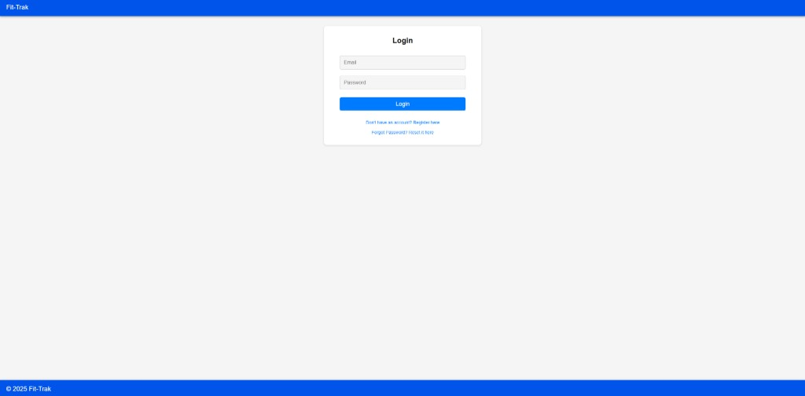
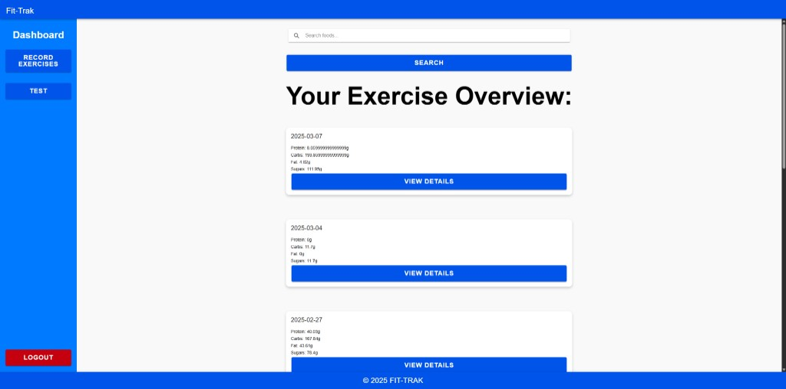
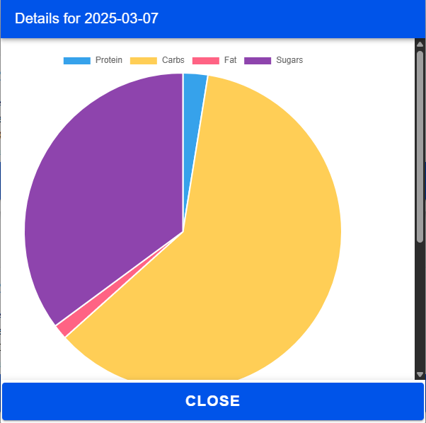
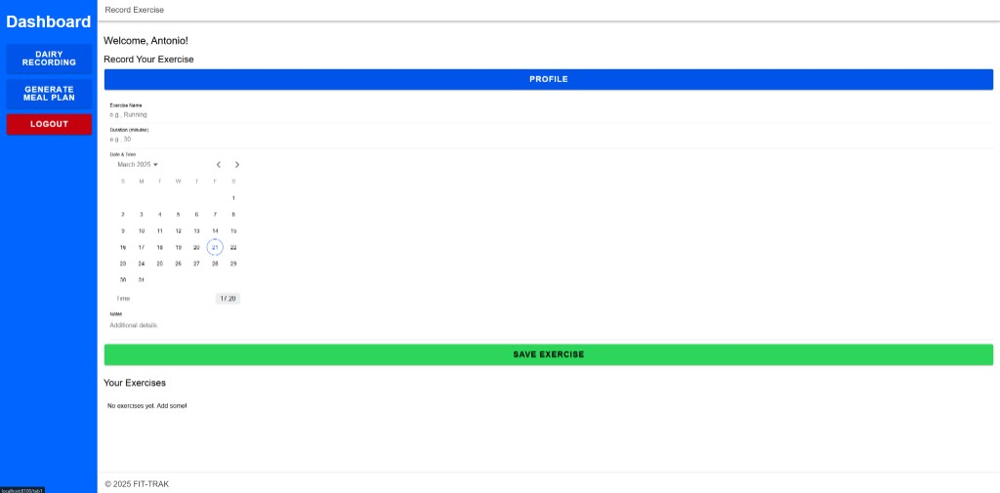
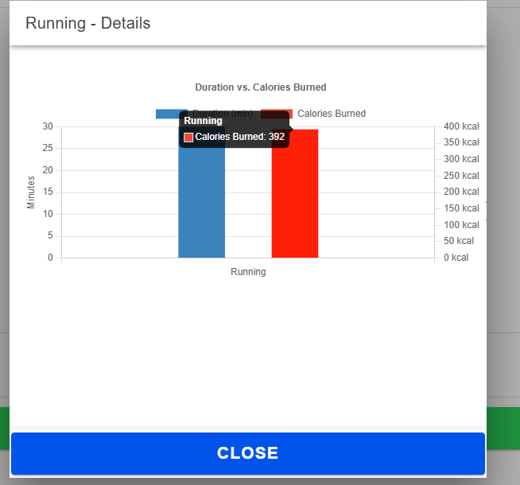
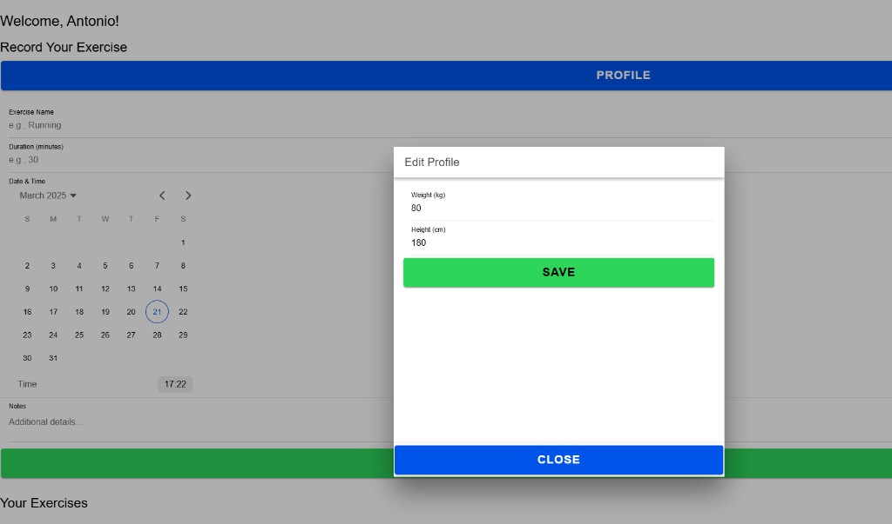
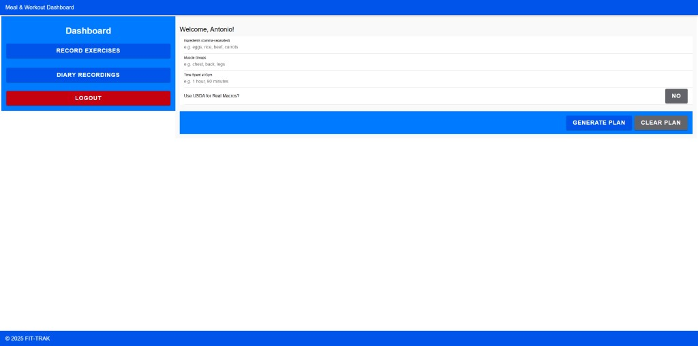

# Fit-Trak

Fit-Trak is a fitness tracking web app built with Ionic + React. It helps users log nutrition, record exercises, and generate meal/workout plans with AI support.

This project was created as part of a dissertation application project during the final year of my university life.

## Features

- User authentication with Firebase (register, login, password reset)
- Nutrition logging with USDA FoodData Central search
- Daily diary entries with macro summaries (protein, carbs, fat, sugars)
- Exercise recording with estimated calories burned
- Pinned/favourite workouts and meals
- AI-assisted meal and workout generation (OpenAI API)
- Charts and data visualisation with Chart.js
- Responsive interface using Ionic components

## Tech Stack

- Ionic React
- React + TypeScript
- Vite
- Firebase Authentication + Firestore
- Chart.js + react-chartjs-2
- Cypress (E2E tests)
- Vitest + Testing Library (unit tests)

## Project Structure

This repository contains the app in:

- `fit-trak/`

Main source code lives under:

- `fit-trak/src/`

## Prerequisites

Install the following before running locally:

- Node.js 18+ (recommended)
- npm 9+ (recommended)
- Ionic CLI

Install Ionic CLI globally:

```bash
npm install -g @ionic/cli
```

## Getting Started

1. Clone the repository:

```bash
git clone https://github.com/<your-username>/<your-repo-name>.git
```

2. Move into the app directory:

```bash
cd <your-repo-name>/fit-trak
```

3. Install dependencies:

```bash
npm install
```

4. Configure environment variables (see next section).

5. Start the development server:

```bash
npm run dev
```

## Environment Variables

Create a `.env` file inside `fit-trak/`:

```env
VITE_OPENAI_API_KEY=your_openai_api_key
VITE_USDA_API_KEY=your_usda_api_key
```

Notes:

- `VITE_OPENAI_API_KEY` is required for meal/workout generation.
- `VITE_USDA_API_KEY` is used for food search and optional macro enrichment.
- Firebase configuration is currently defined in `fit-trak/src/firebaseConfig.ts`.

## Available Scripts

Run these inside `fit-trak/`:

- `npm run dev` - Start local dev server
- `npm run build` - Type-check and build production bundle
- `npm run preview` - Preview production build locally
- `npm run lint` - Run ESLint
- `npm run test.unit` - Run unit tests with Vitest
- `npm run test.e2e` - Run Cypress end-to-end tests

## Testing

### Unit tests

```bash
npm run test.unit
```

### End-to-end tests

```bash
npm run test.e2e
```

## Deployment

Build for production:

```bash
npm run build
```

For mobile targets, use Capacitor as needed (Android/iOS setup is project-specific).

## Security and Configuration Notes

- Do not commit private API keys to source control.
- Consider moving Firebase config values to environment variables for cleaner environment separation.
- Validate Firestore security rules before production deployment.

## Screenshots

### Login



### Nutrition Dashboard



### Nutrition Details Chart



### Exercise Recording



### Exercise Details Chart



### Profile Modal



### Meal and Workout Dashboard



## Future Improvements
- Add architecture diagram and data model
- Add contribution guidelines and issue templates
- Add CI pipeline status badge

## Author

Anton

## License

Choose and add a license (for example: MIT) if this project will be shared publicly.
